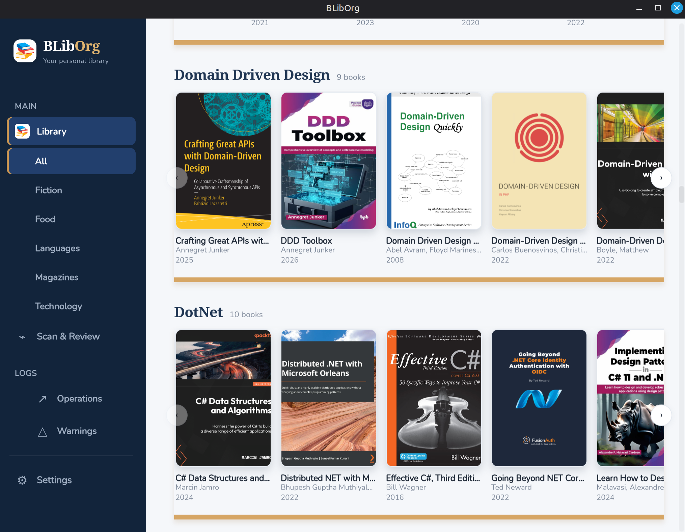

# BLibOrg

BLibOrg or Book Library and Organiser, is my personal Book Library and Organiser.
I hope this tool could be useful for you, and become a BLibOr like I am one day (Pun intended).

It is a tool for organising a messy ebook library: it scans a folder of
`.epub` / `.pdf` / `.mobi` / `.azw3` files, works out each book's title,
author, and year (from embedded metadata, or filename heuristics when
metadata is missing), and renames/moves them into a consistent
`Category/Subcategory/Title (Year) - Author.ext` structure — with a manual
review step before anything on disk changes.



## Problem

Ebooks pile up with wildly inconsistent filenames — site-tag junk, `+`/`_` used instead of spaces, and
garbage bracketed text mixed in with real metadata, e.g.:

- `Build+Your+API+with+Spring.pdf`
- `Building Resilient Distributed Systems (2024, O&_039_Reilly Media, Inc.).pdf`

No single regex parses all of these reliably, so the tool combines embedded
metadata, best-effort filename heuristics, and a mandatory review/edit step
before any file is renamed or moved.

## How it works

```
Scanner → Metadata Extractors → Heuristic Filename Parser → Book Record
                                                                 |
                                       Categorizer (rules -> genre -> Uncategorized)
                                                                 |
                                             Duplicate Detector (title+author+size)
                                                                 |
                                   UI: review/edit list (Scan & Review) -> destination preview
                                                                 |
                                        Apply -> Command-based Operation Log -> Undo/Redo
```

1. **Scan** the working folder for supported ebook formats.
2. **Extract metadata** per format (EPUB via OPF, MOBI/AZW3 via EXTH header,
   PDF via the Info dictionary) — local only, no network lookups.
3. **Fall back to filename heuristics** for whatever fields metadata
   couldn't resolve (strip known site tags, normalize delimiters, pull a
   year out of the text). This is best-effort by design, which is why manual
   review is mandatory, not optional.
4. **Categorize** against user-defined rules (first match wins), falling
   back to embedded genre metadata, then to `Uncategorized`.
5. **Flag likely duplicates** (matching title+author, plus file size for
   same-format pairs) — never auto-deleted, always surfaced for manual
   review.
6. **Review and edit** every book in a table before anything is touched.
7. **Preview destination paths**, then **Apply** — each move/rename is
   logged as a `Command` so batches can be undone/redone, even after an app
   restart.

### Uncategorized files

If no `rules` entry matches a book (by author, title, filename regex, or
metadata subject) and its embedded genre/subject metadata doesn't match any
configured subcategory name either, it's filed under `Uncategorized` with no
subcategory — e.g. `library_folder/Uncategorized/Title (Year) - Author.epub`.
This is a normal fallback, not an error or a blocked state:

- It shows up in Scan & Review with an `Uncategorized` destination preview
  like any other book.
- It's still Apply-eligible as long as its Title resolved — Apply, Undo, and
  Redo treat it no differently from a matched category.
- Nothing is skipped, quarantined, or left behind in the working folder
  because it didn't match a category.

There's currently no UI for reassigning a book's category directly (only
Title/Author/Year are editable in Scan & Review). To get a book out of
`Uncategorized`, add a matching rule to `rules` in `config.yaml` and rescan,
or correct whichever field the desired rule matches on (e.g. fix a
misspelled author so an existing author rule catches it).

A related but separate case: if a rule *does* match but names a category or
subcategory not declared under `categories:` in the config, the book is
still filed there (the rule wins regardless), but a warning is appended to
`log_folder/category-warnings.jsonl` on every scan so the mismatch isn't
silent. That warning isn't surfaced in the UI yet, only in the log file.

## Status

The design is finalized (see [`design.md`](design.md) and
[`docs/superpowers/specs/2026-07-08-book-organiser-design.md`](docs/superpowers/specs/2026-07-08-book-organiser-design.md)).
The Go backend pipeline (scanning, metadata extraction, heuristics,
categorization, duplicate detection, path building, undo/redo) and a Wails +
Svelte desktop UI are implemented and merged into `main`, per the plans in
[`docs/superpowers/plans/2026-07-08-backend-pipeline.md`](docs/superpowers/plans/2026-07-08-backend-pipeline.md)
and
[`docs/superpowers/plans/2026-07-11-ui-scan-review.md`](docs/superpowers/plans/2026-07-11-ui-scan-review.md).
The UI currently covers a single Scan & Review screen — scan, inline edit,
destination path, and duplicate flags per book, then Apply. The backend
already supports undo/redo and config-driven categorization, but there's no
UI yet for undo/redo history or editing categories/rules outside the YAML
file directly (the design spec's "Organiser & History" view).

## Getting started

### Prerequisites

- [Go](https://go.dev/dl/) 1.25+
- [Node.js](https://nodejs.org/) 20+ (for the Svelte frontend)
- [Wails CLI](https://wails.io/docs/gettingstarted/installation) v2:
  `go install github.com/wailsapp/wails/v2/cmd/wails@latest`
- A native webview, needed only to run the desktop app (not for `go build`/`go test`):
  - **Linux**: `libgtk-3-dev` plus a WebKitGTK dev package — which one depends on your
    distro, since Ubuntu 24.04+/Debian trixie+/Mint 22+ dropped WebKitGTK 4.0 in favor
    of 4.1:
    - Ubuntu 24.04+, Debian 13+, Mint 22+ (webkit2gtk 4.1 only):
      `sudo apt-get install libgtk-3-dev libwebkit2gtk-4.1-dev`, and pass
      `-tags webkit2_41` to every `wails dev`/`wails build` invocation below —
      Wails links against 4.0 by default and won't find 4.1 without that tag.
    - Ubuntu 22.04 and earlier, Debian 12 and earlier (webkit2gtk 4.0 available):
      `sudo apt-get install libgtk-3-dev libwebkit2gtk-4.0-dev`, no extra tag needed.
    - Check which one your distro has with `apt-cache search webkit2gtk` if unsure.
  - **Windows**: [WebView2](https://developer.microsoft.com/microsoft-edge/webview2/) (preinstalled on Windows 10/11)
  - **macOS**: Xcode command line tools

### Build & test the backend

```bash
go build ./...
go test ./...
```

### Run the desktop app in development mode

```bash
cd desktop
wails dev
# on webkit2gtk-4.1-only distros (see Prerequisites): wails dev -tags webkit2_41
```

This starts the app with hot reload for the Svelte frontend. Scan reads its
config from a fixed, OS-standard path — `<user config dir>/BLibOrg/config.yaml`
(e.g. `~/.config/BLibOrg/config.yaml` on Linux, `%AppData%\BLibOrg\config.yaml`
on Windows) — see [Configuration](#configuration) for its contents.

### Build a production binary

```bash
cd desktop
./build.sh
# on webkit2gtk-4.1-only distros (see Prerequisites): ./build.sh -tags webkit2_41
```

Produces a single native binary under `desktop/build/bin/` for the host
platform — no installer or bundled runtime beyond the OS webview.
`build.sh` wraps `wails build` and forwards every argument to it (so
`-tags webkit2_41` etc. still work); calling `wails build` directly still
works too, it just skips the config sync described below.

Before building, `build.sh` copies a `config.yaml` at the repo root (if
present) into the fixed OS user-config location the app reads from — see
[Configuration](#configuration). This is a convenience for keeping your
rules/categories under version control at the repo root without the app
ever reading that copy directly; **the sync only happens at build time**,
so editing the repo-root `config.yaml` has no effect until you rebuild.
The previous contents of the real config are backed up to `config.yaml.bak`
next to it before being overwritten.

### Linux: taskbar icon

On Linux, Wails does not reliably set the running window's icon via the raw
X11 icon hints (observed on Linux Mint/Cinnamon: the taskbar/window-list
shows a generic icon instead of `appicon.png`, even though the icon data
itself is valid). Desktop environments resolve a window's icon primarily
through its `.desktop` file, so ship one:

```bash
cp desktop/build/linux/bliborg.desktop ~/.local/share/applications/
# edit Exec= and Icon= in that copy to the absolute paths of your checkout,
# e.g. Exec=/home/you/BLibOrg/desktop/build/bin/bliborg
update-desktop-database ~/.local/share/applications   # optional, refreshes the menu cache
```

`StartupWMClass=bliborg` matches the `WM_CLASS` the built binary reports
(derived from `wails.json`'s `outputfilename`). If that filename ever
changes, update `StartupWMClass` to match, or the desktop environment won't
associate the running window with this launcher.

**Without this file installed, the taskbar icon silently reverts to a
generic/broken-looking icon** — there's no error, it just looks wrong,
and it's easy to lose track of having installed it (e.g. after a
`~/.local/share/applications` cleanup). If the icon looks off again,
check `ls ~/.local/share/applications/bliborg.desktop` first
before assuming something in the app itself regressed.

**Two separate icon files, two separate renderers, don't conflate them:**
- `desktop/build/appicon.png` is compiled into the binary via `//go:embed`
  and wired through `options.Linux.Icon` in `desktop/main.go`. It's
  flattened onto an **opaque white background** (no alpha channel) on
  purpose: this specific consumer is Wails' own legacy X11
  `icon_pixmap`+mask code, which doesn't apply alpha correctly on Linux
  Mint/Cinnamon — a transparent PNG here renders as a black box, because
  the pixels *underneath* the transparency happen to be black. Do not
  "fix" this one to be transparent again.
- `desktop/build/appicon-transparent.png` is only ever referenced by the
  `.desktop` file's `Icon=` line, which the desktop environment loads
  through its normal icon-theme/pixbuf pathway — a completely different
  code path from the one above, and one that *does* composite alpha
  correctly. This file keeps its real transparency, so the icon blends
  into the dark taskbar like every other app's icon instead of showing as
  a jarring white square.

If you ever regenerate the app icon from a new source image, flatten a
copy for `appicon.png` (the embedded one) but keep `appicon-transparent.png`
as a genuinely transparent PNG — the two are not interchangeable.

### Frontend-only commands

```bash
cd desktop/frontend
npm install
npm run build   # production build, output to dist/ (required before `go build ./...` picks up desktop/main.go's embed)
npm test        # vitest
```

## Tech stack

- **Go** for the backend — chosen for cross-platform builds and no runtime
  dependency.
- **Wails** for the desktop shell — a Go backend + HTML/CSS/JS frontend
  rendered in the OS's native webview, producing a single small binary per
  platform (no bundled Chromium, unlike Electron).
- **Svelte + TypeScript** for the frontend.
- Zero CGO, zero non-Go-toolchain build dependencies — the PDF and
  MOBI/AZW3 metadata extractors are small dependency-free parsers rather
  than wrappers around a full third-party library, so the app stays easy to
  cross-compile for Windows and Linux.

## Scope (v1)

- Supported formats: EPUB, PDF, MOBI, AZW3.
- Metadata is local only — embedded file metadata plus filename heuristics.
  No online lookups (Google Books, Open Library, ISBN databases, etc.).
- Duplicates are always surfaced for manual review; the tool never
  auto-deletes.
- Out of scope: CBZ/CBR, DJVU, FB2, plain archive formats.

## Configuration

Working folder, library folder, operation-log folder, filename format,
categories/subcategories, and categorization rules are all defined in a YAML
config file.

**The app only ever reads this one fixed location** — not a `config.yaml` in
the repo or the app's working directory, and there's no file picker or
`--config` flag to point it elsewhere. (`desktop/build.sh` can sync a
repo-root `config.yaml` into this location at build time — see
[Build a production binary](#build-a-production-binary) — but that's a
build-time copy step, not something the app does itself at runtime.)

| OS      | Path                                             |
|---------|---------------------------------------------------|
| Linux   | `~/.config/BLibOrg/config.yaml`             |
| Windows | `%AppData%\BLibOrg\config.yaml`             |
| macOS   | `~/Library/Application Support/BLibOrg/config.yaml` |

(Exactly `os.UserConfigDir()/BLibOrg/config.yaml` —
see `internal/appapi.DefaultConfigPath`.) The file must be created by hand;
nothing generates a default one yet. If it's missing or invalid, both the
app's startup check and the Scan button surface a "no usable config at
`<path>`" banner naming the exact path it looked for.

Example contents:

```yaml
general:
  working_folder: "D:/Ebooks/Inbox"
  library_folder: "D:/Ebooks/Library"
  log_folder: "D:/Ebooks/.book-organiser-logs"
  filename_format: "{title} ({year}) - {author}"

heuristics:
  known_junk_tags: ["OceanofPDF.com", "libgen.li", "libgen.rs", "z-lib.org"]

categories:
  Fiction:
    subcategories: [Sci-Fi, Fantasy, Mystery, General]
  NonFiction:
    subcategories: [Technology, History, Biography, General]
  Uncategorized:
    subcategories: []

# Rules are checked in order; first match wins.
# match_field can be: author, title, filename, metadata_subject
rules:
  - match_field: author
    match_value: "Isaac Asimov"
    category: Fiction
    subcategory: Sci-Fi
  - match_field: metadata_subject
    match_value: "Fantasy"
    category: Fiction
    subcategory: Fantasy
  - match_field: filename
    match_value: "(?i)docker|kubernetes|golang"
    category: NonFiction
    subcategory: Technology
```

## Documentation

- [`design.md`](design.md) — original v1 design notes.
- [`docs/superpowers/specs/2026-07-08-book-organiser-design.md`](docs/superpowers/specs/2026-07-08-book-organiser-design.md) — finalized design spec.
- [`docs/superpowers/plans/2026-07-08-backend-pipeline.md`](docs/superpowers/plans/2026-07-08-backend-pipeline.md) — backend implementation plan.

## Gotchas

- **`runtime.MessageDialog`'s custom `Buttons` are macOS-only.** On
  Linux/Windows, Wails ignores a custom `Buttons` list and shows a default
  Yes/No dialog instead — so code that checks the dialog result against one
  of the custom labels (e.g. `result == "Move files"`) will silently and
  permanently fail to match on those platforms, with no error surfaced.
  This bit `ConfirmApply` in `desktop/app.go`: Apply appeared to do nothing
  when clicked on Linux, because the confirm dialog's "Yes" click was never
  recognized as an affirmative answer. Fixed by having `isAffirmative`
  accept the platform's real default labels ("Yes", "OK") alongside the
  custom one, instead of comparing against the custom label alone. When
  adding another `MessageDialog` with custom buttons, match on multiple
  known labels rather than a single literal string.

## Reference

[na--/ebook-tools](https://github.com/na--/ebook-tools) was used as prior
art, though this project deliberately doesn't replicate its full feature
set.

The app icon (`desktop/build/appicon.png`) is
<a href="https://www.flaticon.com/free-icons/library" title="library icons">Library icons created by popo2021 - Flaticon</a>.
